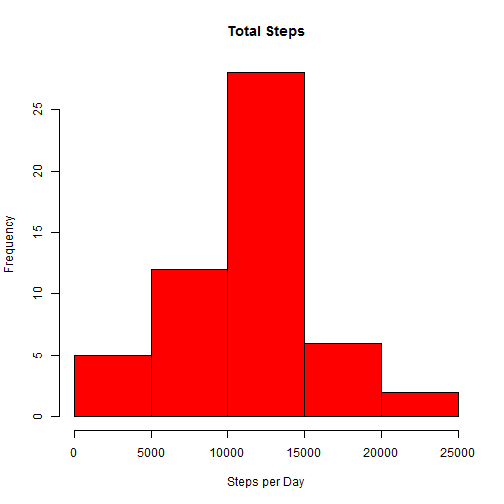
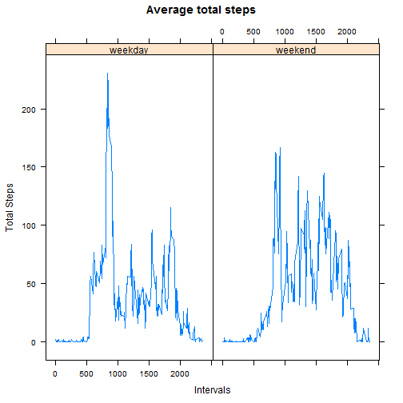

This document will complete the first course project for this course, where I will perform some simple analysis on an activity monitoring data set avaialable from the assignment website.

## Part 1: Load the data


```r
if(!file.exists("activityData")) {dir.create("activityData")}
url <- "https://d396qusza40orc.cloudfront.net/repdata%2Fdata%2Factivity.zip"
download.file(url, destfile="activityData\\activityData.zip")
unzip(zipfile="activityData\\activityData.zip", exdir="activityData")

activityData <- read.csv("activityData\\activity.csv")
```

## Part 2: What is mean total number of steps taken per day?

Next I will calculate the total number of steps taken per day, make a histogram of the total steps, and calculate the mean and median of the total steps.  My analysis requires the `dplyr` package.

### 2.1 Total Steps


```r
library(dplyr)
total <- activityData %>%
  group_by(date) %>%
        filter(!is.na(steps)) %>%
        summarise(total_steps = sum(steps, na.rm=TRUE))
```

### 2.2 Histogram showing the total steps


```r
hist(total$total_steps, 
    main = "Total Steps",
    xlab = "Steps per Day",
    ylab = "Frequency",
    col = "red")
```



### 2.3 Calculate the mean/median steps per day


```r
mean(total$total_steps)
```

```
## [1] 10766.19
```

```r
median(total$total_steps)
```

```
## [1] 10765
```

## Part 3: What is the average daily activity pattern?

For this portion of the assignment I will break the data down based on the average number of steps per 5-minute interval and create a time series plot for this data.  I will then determine which 5-minute interval contains the maximum number of steps on average.

### 3.1 Create a time series plot of the average number of steps per 5-minute interval


```r
interval <- activityData %>%
    group_by(interval) %>%
    filter(!is.na(steps)) %>%
    summarise(avg_steps = mean(steps, na.rm=TRUE))

plot(interval$interval, interval$avg_steps, type = "l",
     main = "Average steps per 5-minute interval",
     xlab = "Interval",
     ylab = "Average Steps",
     col = "blue")
```


### 3.2 Which 5-minute interval averages the most steps?


```r
highest <- interval[which.max(interval$avg_steps), ]
highestInt <- highest$interval
highestInt
```

```
## [1] 835
```

Interval 835 has the most average steps.

## Part 4: Imputing missing values

For this portion, I will calculate the number of missing values in the data set, fill in the missing values using the 5-minute interval mean, and make a histogram of the new data set, and calculate the mean/median of the new set.  I will then evaluate how the new data set differs from the original.

### 4.1 Calculate and report the total number of missing values in the dataset


```r
sum(is.na(activityData))
```

```
## [1] 2304
```

### 4.2 Find means of each 5-minute interval


```r
avg_interval <- tapply(activityData$steps, activityData$interval, mean, na.rm=TRUE, simplify = TRUE)
```

### 4.3 Create new data set with NAs replaced by means


```r
completeData <- activityData
nas <- is.na(completeData$steps)
completeData$steps[nas] <- avg_interval[as.character(completeData$interval[nas])]

sum(is.na(completeData))
```

```
## [1] 0
```

### 4.4 Make histogram, calculate mean/median of new set, evaulate differences


```r
total2 <- completeData %>%
  group_by(date) %>%
        filter(!is.na(steps)) %>%
        summarise(total_steps = sum(steps, na.rm=TRUE))

hist(total2$total_steps, 
    main = "Total Steps",
    xlab = "Steps per Day",
    ylab = "Frequency",
    col = "red")
```


```r
mean(total2$total_steps)
```

```
## [1] 10766.19
```

```r
median(total2$total_steps)
```

```
## [1] 10766.19
```

The new data set is idential in mean, similar in median, and the new histogram indicates that a larger frequency of measurements lie in the center.

## Part 5: Are there differences in activity patterns between weekdays and weekends?

In Part 5 I will add a dimension to the data set to differentiate the weekdays from the weekend days and make time series plots evaluating the differences between these.

### 5.1 Add a new factor variable indicating "weekday" or "weekend"


```r
completeData$date <- as.Date(completeData$date)

completeData$dayType  <- ifelse(weekdays(completeData$date) %in% c("Saturday", "Sunday"), "weekend", "weekday")
completeData$dayType  <- as.factor(completeData$dayType)
```

### 5.2 Create time series plots for each factor of the average number of steps per 5-minute interval


```r
interval2 <- completeData %>%
        group_by(interval, dayType)%>%
        summarise(avg_steps = mean(steps, na.rm=TRUE))

library(lattice)
with(interval2, 
      xyplot(avg_steps ~ interval | dayType, 
      type = "l",      
      main = "Average total steps",
      xlab = "Intervals",
      ylab = "Total Steps"))
```


